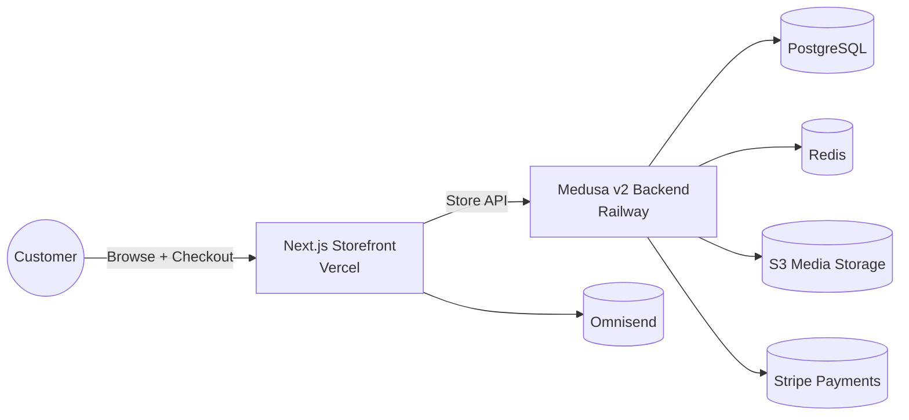
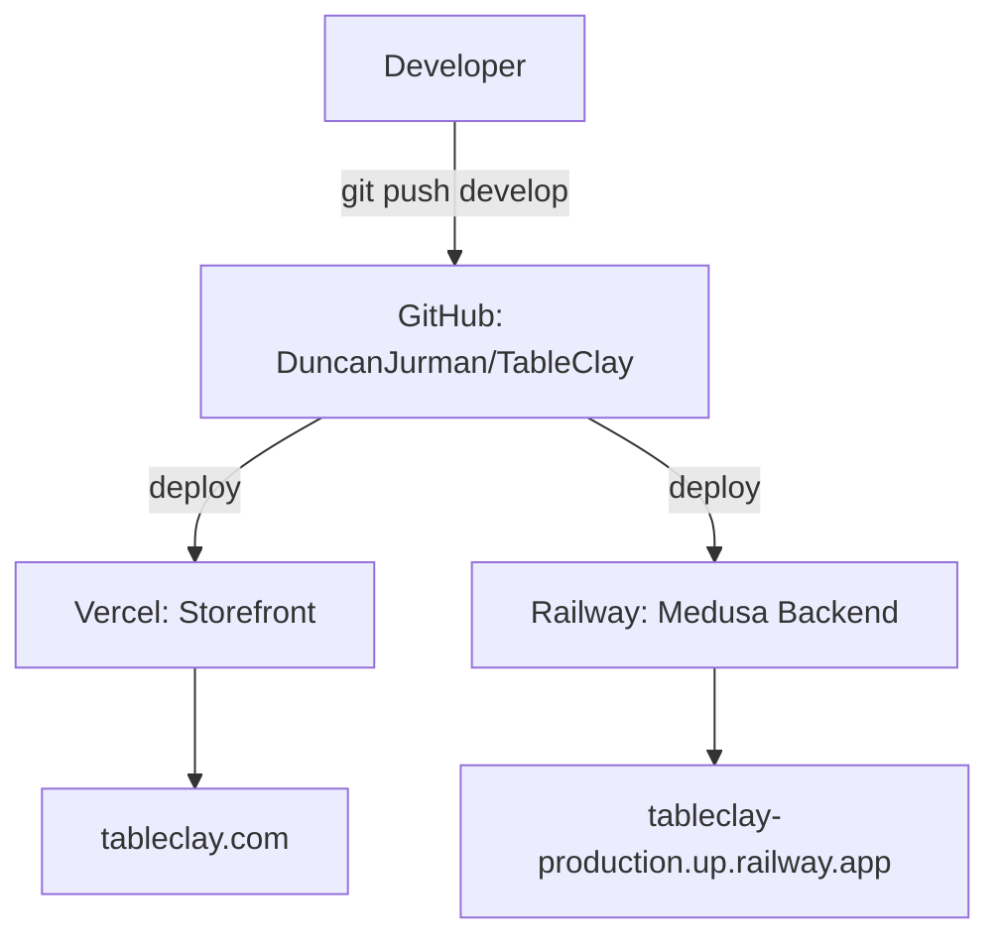

# TableClay

TableClay is a full-stack commerce platform for a handmade pottery brand, built on Medusa v2 with a custom storefront and backend modules.

## Production endpoints
- Storefront: https://tableclay.com
- Backend API: https://tableclay-production.up.railway.app
- Admin Dashboard: https://tableclay-production.up.railway.app/app
- Health Check: https://tableclay-production.up.railway.app/health

## System architecture


## Deployment flow


## Repository layout
- `table-clay-store/`: Medusa backend with custom modules and APIs.
- `table-clay-storefront/`: Next.js storefront (App Router) deployed to Vercel.
- `packages/`: Medusa core packages (upstream source).
- `www/`: Docs and content site.
- `Docs/`: Project-specific documentation and runbooks.
- `scripts/`: Utilities and automation.

## Package management
We deliberately use different package managers per area to match deployment environments.

| Area | Path | Package manager | Lockfile | Notes |
| --- | --- | --- | --- | --- |
| Monorepo core + docs | `TableClay/` | Yarn 3 (Berry) | `yarn.lock` | Core Medusa packages + docs tooling. |
| Backend | `TableClay/table-clay-store/` | Yarn 1.22.22 | `yarn.lock` | Dockerfile pins Yarn classic for patch-package. |
| Storefront | `TableClay/table-clay-storefront/` | npm 9 | `package-lock.json` | Vercel uses `npm ci` for deterministic builds. |

Rules of thumb:
- Do not run Yarn in `table-clay-storefront/`.
- Do not regenerate `table-clay-store/` lockfile with npm.
- Use `corepack` to activate the correct Yarn version where needed.

## Local development

### Storefront (Next.js)
```bash
cd TableClay/table-clay-storefront
npm install
npm run dev
```

Required env vars (see `table-clay-storefront/.env.example`):
```env
NEXT_PUBLIC_MEDUSA_BACKEND_URL=
NEXT_PUBLIC_MEDUSA_PUBLISHABLE_KEY=
NEXT_PUBLIC_BASE_URL=
NEXT_PUBLIC_DEFAULT_REGION=us
NEXT_PUBLIC_OMNISEND_BRAND_ID=
```

### Backend (Medusa)
```bash
cd TableClay/table-clay-store
corepack prepare yarn@1.22.22 --activate
yarn install
yarn dev
```

Key env vars (see `table-clay-store/.env.template`):
```env
DATABASE_URL=
REDIS_URL=redis://localhost:6379
JWT_SECRET=
COOKIE_SECRET=
OMNISEND_API_KEY=
```

## Testing
- Storefront: `npm run test:ci` and `npm run build`
- Backend: `yarn test:unit` or `yarn test:ci`

## Docs & runbooks
- Backend details: `Docs/backend.md`
- Storefront details: `Docs/frontend.md`
- Incident response: `Docs/incident-playbook.md`
- Project-wide instructions: `AGENTS.md`
