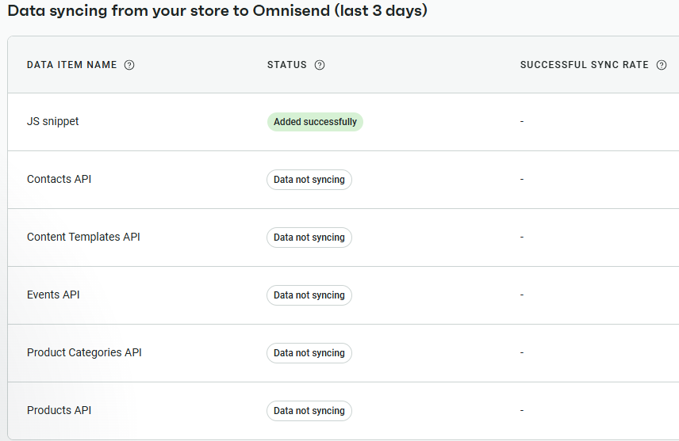
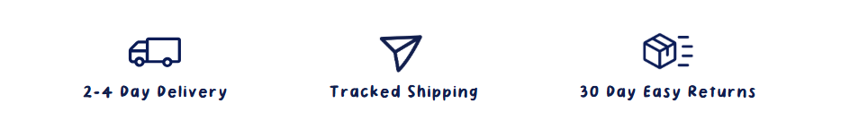
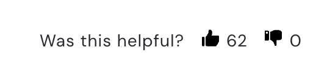
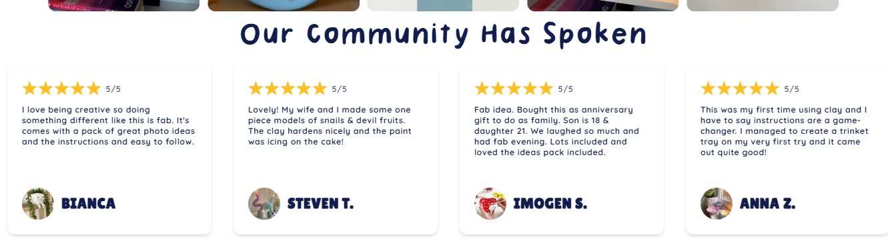

Website Changes:

Integrate community creations form: https://forms.gle/mukkFFxxCTVuiRSf9

Should be applied to the button on the community creations page where people submit their own creations

Integrate review form into the website; https://forms.gle/TQVvphoZkY5ti1Hf9

Should be accessible via the product detail pages in the review area

Fully Connect Omnisend to ensure that it is receiving all site events that are useful for our main tasks of personalized emails, dynamically inserting products based on site activity, etc. https://api-docs.omnisend.com/docs/how-to-sync-products-catalog-categories

It appears that the contacts API, Content templates API, Events API, Product categories  API, and Products API and not currently sending data to Omnisend

Integrate shipping / returns related proof claims onto the website, product detaIl page, and perhaps cart / checkout page. See getpottd.com for a good example on their home page.

Integrate “was this helpful on reviews”  (seen mindclaystudio.com for an exmaple)

Have this be interactive and perhaps set it on a scale of total question reviews (i.e., 20% of total reviews find helpful, 2% find unhelpful?)

Integrate Venmo as a payment option on both mobile and desktop site

Update home page reviews trip (single review right now), to be better practice and more like this example (website is getpottd.com):

Product Listing Changes (AGENT IGNORE THIS SECTION):

(Nick to update using Nano and site backend)

Update the following listing images to ensure we have no Gemini Watermarks

Blue & Pink Cloud set.

Add more photos to>

Floral Bowl

Love bird Jewlery dish (ensure colors we can source and update greene tih white outside to be the correct color

ANother star bowl photo cereal maybe?

Pixel / Advertising data Changes (AGENT IGNORE THIS SECTION):

Ensure that meta CAPI & Tiktok API is correctly sending through all relevant events
